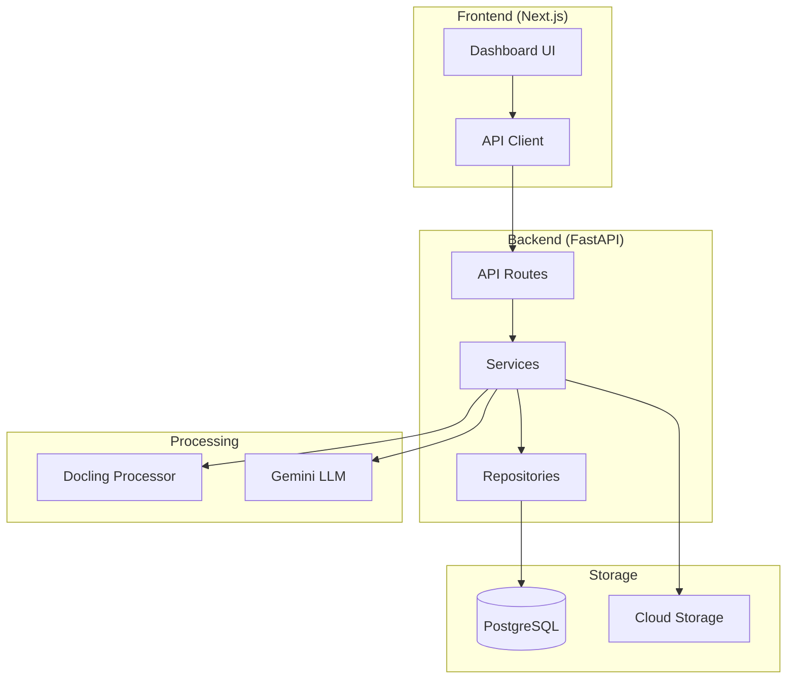

# Phase 7: Documentation & Testing - Research

**Researched:** 2026-01-24
**Domain:** Technical Documentation, Python Testing, Type Safety
**Confidence:** HIGH

## Summary

Phase 7 covers two distinct but related domains: comprehensive system documentation and production-grade test coverage. The documentation requirements focus on three core documents (SYSTEM_DESIGN.md, ARCHITECTURE_DECISIONS.md, README.md) using established formats like ADRs and Mermaid diagrams. The testing requirements target >80% backend coverage using pytest with async support, mypy strict mode compliance, and frontend build verification.

The project already has strong foundations in place:
- 23 test files with 269 test cases exist in the backend
- pytest ecosystem (pytest-asyncio, pytest-mock, pytest-cov) is configured
- mypy strict mode is configured in pyproject.toml (but excludes tests)
- Established conftest.py fixtures for async testing with FastAPI

**Primary recommendation:** Focus documentation on leveraging existing phase decisions and code patterns. For testing, expand existing test infrastructure rather than creating new patterns, adding targeted tests to reach 80% coverage and extending mypy strict mode to include test files.

## Standard Stack

The established tools and libraries for documentation and testing:

### Core Testing

| Library | Version | Purpose | Why Standard |
|---------|---------|---------|--------------|
| pytest | >=8.3.0 | Test framework | Industry standard, excellent async support, fixture system |
| pytest-asyncio | >=1.3.0 | Async test support | Native asyncio integration, auto mode for seamless async testing |
| pytest-mock | (bundled) | Mocking | Enhanced unittest.mock integration with mocker fixture |
| pytest-cov | >=6.0.0 | Coverage reporting | Industry standard, integrates with coverage.py |
| pytest-xdist | (to add) | Parallel execution | Speeds up large test suites, recommended for CI |
| mypy | >=1.14.0 | Static type checking | Industry standard, strict mode enforces full type safety |

### Documentation

| Tool | Version | Purpose | Why Standard |
|------|---------|---------|--------------|
| Mermaid | (Markdown) | Diagram as code | Version-controlled, GitHub/GitLab native rendering |
| MADR Template | ADR format | Decision records | Widely adopted, clear structure |

### Supporting

| Library | Version | Purpose | When to Use |
|---------|---------|---------|-------------|
| httpx | >=0.28.0 | Async HTTP client | FastAPI async testing via ASGITransport |
| aiosqlite | >=0.21.0 | SQLite async driver | In-memory test database |
| ruff | >=0.8.0 | Linting | Already configured, use for code style |

### Alternatives Considered

| Instead of | Could Use | Tradeoff |
|------------|-----------|----------|
| pytest-cov | coverage.py directly | pytest-cov provides better integration |
| Mermaid | draw.io/Lucidchart | Mermaid is version-controlled, text-based |
| MADR | Nygard ADR | MADR more detailed, includes options considered |
| Playwright | Vitest only | Playwright better for E2E smoke tests |

**Installation:**
```bash
# Already in pyproject.toml - may need pytest-xdist
pip install pytest-xdist
```

## Architecture Patterns

### Recommended Test Directory Structure

The existing structure follows the source-mirror pattern:

```
backend/tests/
├── conftest.py              # Shared fixtures (client, db_session)
├── unit/                    # Unit tests (fast, isolated)
│   ├── test_repositories.py
│   ├── test_docling_processor.py
│   ├── test_borrower_repository.py
│   ├── test_borrower_routes.py
│   ├── test_models.py
│   ├── test_gcs_client.py
│   └── test_document_service.py
├── integration/             # Integration tests (API, DB)
│   ├── conftest.py          # Integration-specific fixtures
│   ├── test_documents_api.py
│   └── test_docling_integration.py
└── extraction/              # Domain-specific tests
    ├── test_llm_client.py
    ├── test_complexity_classifier.py
    ├── test_extractor.py
    ├── test_validation.py
    ├── test_deduplication.py
    ├── test_consistency.py
    ├── test_chunker.py
    └── test_confidence.py
```

### Pattern 1: Async Testing with FastAPI

**What:** Testing async FastAPI endpoints using httpx.AsyncClient with ASGITransport
**When to use:** All API endpoint tests
**Example:**
```python
# Source: backend/tests/conftest.py (existing pattern)
from httpx import ASGITransport, AsyncClient

@pytest.fixture
async def client(async_engine, db_session, mock_gcs_client):
    """Create test client with mocked dependencies."""
    async def override_get_db_session():
        async with session_factory() as session:
            try:
                yield session
                await session.commit()
            except Exception:
                await session.rollback()
                raise

    app.dependency_overrides[get_db_session] = override_get_db_session

    transport = ASGITransport(app=app)
    async with AsyncClient(transport=transport, base_url="http://test") as client:
        yield client

    app.dependency_overrides.clear()
```

### Pattern 2: Mock External Services

**What:** Mocking GCS, Gemini API, and other external services using spec-based mocks
**When to use:** Any test touching external APIs
**Example:**
```python
# Source: backend/tests/integration/conftest.py (existing pattern)
@pytest.fixture
def mock_gcs_client():
    """Create mock GCS client."""
    from src.storage.gcs_client import GCSClient

    client = MagicMock(spec=GCSClient)
    client.upload = MagicMock(return_value="gs://test-bucket/documents/test/file.pdf")
    client.download = MagicMock(return_value=b"file content")
    client.exists = MagicMock(return_value=True)
    return client
```

### Pattern 3: Database Testing with In-Memory SQLite

**What:** Using aiosqlite for fast, isolated database tests
**When to use:** Repository and model tests
**Example:**
```python
# Source: backend/tests/integration/conftest.py (existing pattern)
@pytest.fixture
async def async_engine():
    """Create async SQLite engine for testing."""
    engine = create_async_engine(
        "sqlite+aiosqlite:///:memory:",
        echo=False,
    )
    async with engine.begin() as conn:
        await conn.run_sync(Base.metadata.create_all)
    yield engine
    await engine.dispose()
```

### Pattern 4: ADR Template (MADR Format)

**What:** Architecture Decision Record with title, context, decision, consequences
**When to use:** Every significant technology choice
**Example:**
```markdown
# ADR-001: Use Docling for Document Processing

## Status
Accepted

## Context
We need to process PDF, DOCX, and image files to extract text content
with layout understanding. Options include:
- Docling: Production-grade, supports tables, OCR built-in
- PyPDF2 + python-docx: Lighter, but no OCR, limited table support
- Unstructured.io: Cloud-based, cost per document

## Decision
Use Docling (>=2.70.0) as the document processing engine.

## Consequences
**Positive:**
- Production-grade PDF/DOCX/image parsing
- Built-in OCR for scanned documents
- Table extraction with structure preservation
- Page-level metadata for source attribution

**Negative:**
- Heavy dependency (~500MB with models)
- Slower cold starts on Cloud Run
```

### Anti-Patterns to Avoid

- **Shared mutable state between tests:** Each test should be isolated; use fixtures with function scope
- **Testing implementation details:** Test behavior, not internal implementation
- **Excessive mocking:** Don't mock the code under test; only mock external dependencies
- **Missing error path coverage:** Every error path needs a test (validation failures, network errors)
- **type: ignore without error codes:** Always use specific codes like `# type: ignore[arg-type]`

## Don't Hand-Roll

Problems that look simple but have existing solutions:

| Problem | Don't Build | Use Instead | Why |
|---------|-------------|-------------|-----|
| Coverage measurement | Manual line counting | pytest-cov | Accurate branch coverage, reporting |
| Mock creation | Custom mock classes | MagicMock(spec=Class) | Ensures mock matches real API |
| Async test setup | Manual event loop management | pytest-asyncio auto mode | Handles loop lifecycle |
| ADR formatting | Custom markdown templates | MADR template | Industry standard, tooling support |
| Diagram generation | ASCII art diagrams | Mermaid | Version-controlled, auto-renders |
| Parallel tests | Manual subprocess management | pytest-xdist | Built-in test distribution |

**Key insight:** The pytest ecosystem handles nearly all testing infrastructure needs. Focus effort on writing tests, not test infrastructure.

## Common Pitfalls

### Pitfall 1: pytest-asyncio Mode Confusion

**What goes wrong:** Tests hang or fail when mixing async/sync fixtures incorrectly
**Why it happens:** pytest-asyncio auto mode expects consistent async fixture usage
**How to avoid:** Use auto mode (already configured in pyproject.toml), mark async fixtures with `@pytest.fixture` and declare as `async def`
**Warning signs:** Tests hang, "loop is closed" errors, fixture scope warnings

### Pitfall 2: mypy Strict Mode Violations from Third-Party Types

**What goes wrong:** mypy errors from external libraries without type stubs
**Why it happens:** Strict mode requires types everywhere; some libraries lack stubs
**How to avoid:** Use `ignore_missing_imports = true` (already configured), create per-module overrides for problematic libraries
**Warning signs:** "Cannot find implementation or library stub" errors

### Pitfall 3: Coverage Exclusion Gaps

**What goes wrong:** Coverage appears low because defensive code isn't counted correctly
**Why it happens:** Standard exclusions miss patterns like `if TYPE_CHECKING:` blocks
**How to avoid:** Configure exclude_also in pyproject.toml with project-specific patterns
**Warning signs:** Coverage lower than expected despite tests passing

### Pitfall 4: Flaky Async Tests

**What goes wrong:** Tests pass sometimes, fail other times
**Why it happens:** Race conditions in async code, shared state, timing-dependent assertions
**How to avoid:** Use explicit waits, ensure fixture isolation, avoid time.sleep in tests
**Warning signs:** Tests fail in CI but pass locally, intermittent failures

### Pitfall 5: Documentation Drift

**What goes wrong:** Documentation doesn't match actual implementation
**Why it happens:** Documentation written once and not updated with code changes
**How to avoid:** Document from code (leverage existing STATE.md decisions), reference actual files and patterns
**Warning signs:** Mermaid diagrams show non-existent components, ADRs reference outdated approaches

### Pitfall 6: Incomplete ADR Context

**What goes wrong:** ADRs lack sufficient context for future readers
**Why it happens:** Writing for current understanding, not future reference
**How to avoid:** Include alternatives considered with pros/cons, link to relevant code/issues
**Warning signs:** "Why did we do X?" questions arise despite having ADR

## Code Examples

Verified patterns from existing codebase and official sources:

### Async Test with Dependency Override

```python
# Source: backend/tests/integration/test_documents_api.py pattern
@pytest.mark.asyncio
async def test_upload_document(client: AsyncClient):
    """Test document upload endpoint."""
    with open("tests/fixtures/sample.pdf", "rb") as f:
        response = await client.post(
            "/api/documents",
            files={"file": ("test.pdf", f, "application/pdf")}
        )

    assert response.status_code == 201
    data = response.json()
    assert "id" in data
    assert data["status"] == "completed"
```

### Mock LLM Client with Response Structure

```python
# Source: backend/tests/extraction/test_llm_client.py pattern
def create_mock_response(
    text: str | None = '{"name": "John Doe"}',
    prompt_tokens: int = 100,
    candidate_tokens: int = 50,
) -> MagicMock:
    """Create a mock Gemini API response."""
    mock_response = MagicMock()
    mock_response.text = text
    mock_response.usage_metadata = MagicMock()
    mock_response.usage_metadata.prompt_token_count = prompt_tokens
    mock_response.usage_metadata.candidates_token_count = candidate_tokens
    return mock_response
```

### Coverage Configuration

```toml
# Source: pyproject.toml pattern extension
[tool.coverage.run]
source = ["src"]
branch = true
omit = ["*/__init__.py", "*/tests/*"]

[tool.coverage.report]
exclude_also = [
    "def __repr__",
    "if TYPE_CHECKING:",
    "raise NotImplementedError",
    "if __name__ == .__main__.:",
    "@abstractmethod",
]
fail_under = 80
```

### Mermaid Architecture Diagram



### Parallel Test Execution

```bash
# Run tests in parallel across CPU cores
pytest -n auto

# Run with specific number of workers
pytest -n 4

# Distribution by file (tests in same file run together)
pytest -n auto --dist loadfile
```

## State of the Art

| Old Approach | Current Approach | When Changed | Impact |
|--------------|------------------|--------------|--------|
| unittest | pytest | 2015+ | Fixture system, parametrize, cleaner assertions |
| mock.patch | MagicMock(spec=) | Always preferred | Type-safe mocks catch API drift |
| sync TestClient | AsyncClient + ASGITransport | httpx 0.23+ | True async testing |
| manual coverage | pytest-cov + GitHub Actions | 2020+ | Automated coverage gates |
| ADRs in wiki | ADRs in repo | Always preferred | Version-controlled, reviewed |
| Image diagrams | Mermaid | 2020+ | Text-based, diffable, auto-renders |

**Deprecated/outdated:**
- `asyncio_mode = "strict"`: Now use "auto" for simpler async test writing
- `@pytest.mark.asyncio`: Not needed with auto mode
- TestClient for async: Use AsyncClient + ASGITransport instead

## Open Questions

Things that couldn't be fully resolved:

1. **Exact current coverage percentage**
   - What we know: 269 tests exist across 23 test files
   - What's unclear: Actual line coverage percentage (would need test run)
   - Recommendation: Run `pytest --cov` during planning to establish baseline

2. **mypy errors in test files**
   - What we know: mypy currently excludes tests/ directory
   - What's unclear: How many type errors exist in test files
   - Recommendation: Run `mypy tests/` to assess scope of work

3. **Frontend smoke test approach**
   - What we know: Next.js 16 supports Playwright and Vitest
   - What's unclear: Whether to add test framework or just verify builds
   - Recommendation: Start with build verification (`npm run build`), add Playwright later if needed

4. **Integration test with real Gemini**
   - What we know: TEST-09 calls for "Flash and Pro models"
   - What's unclear: Whether this means real API calls or mocked with model selection
   - Recommendation: Mock with model selection verification (avoid API costs in tests)

## Sources

### Primary (HIGH confidence)
- pytest official documentation - [How to use fixtures](https://docs.pytest.org/en/stable/how-to/fixtures.html)
- pytest-asyncio 1.3 - [Configuration reference](https://pytest-asyncio.readthedocs.io/en/stable/reference/configuration.html)
- mypy 1.19 - [Configuration file](https://mypy.readthedocs.io/en/stable/config_file.html)
- FastAPI - [Async Tests](https://fastapi.tiangolo.com/advanced/async-tests/)
- pytest-cov 7.0 - [Configuration](https://pytest-cov.readthedocs.io/en/latest/config.html)

### Secondary (MEDIUM confidence)
- [ADR templates on GitHub](https://adr.github.io/adr-templates/) - MADR format
- [Mermaid architecture diagrams](https://mermaid.js.org/syntax/architecture.html)
- AWS Architecture Blog - [ADR best practices](https://aws.amazon.com/blogs/architecture/master-architecture-decision-records-adrs-best-practices-for-effective-decision-making/)
- Next.js - [Testing with Playwright](https://nextjs.org/docs/pages/guides/testing/playwright)

### Tertiary (LOW confidence)
- WebSearch results on pytest-xdist configuration patterns
- WebSearch results on frontend smoke test patterns

## Metadata

**Confidence breakdown:**
- Standard stack: HIGH - Using official documentation and existing project patterns
- Architecture: HIGH - Based on existing codebase patterns that work
- Pitfalls: MEDIUM - Drawn from documentation and common issues in async testing
- Documentation patterns: HIGH - ADR and Mermaid have stable, well-documented formats

**Research date:** 2026-01-24
**Valid until:** 60 days (testing patterns stable, documentation formats rarely change)
