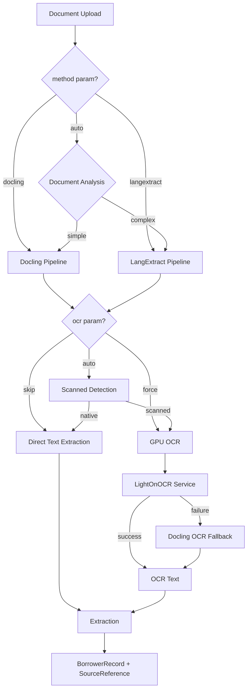
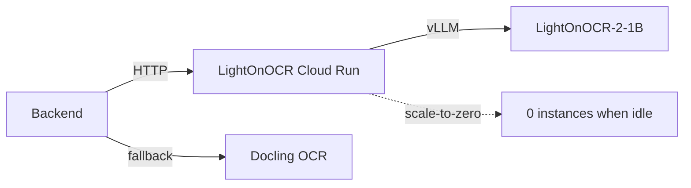

<objective>
Create architecture decision records (ADRs) for v2.0 technical decisions, update system design documentation with dual pipeline architecture, and document Terraform migration procedures.

Purpose: Preserve technical rationale for v2.0 architectural decisions and provide complete system documentation for the dual extraction pipeline.
Output: Updated ARCHITECTURE_DECISIONS.md with 3 new ADRs, updated SYSTEM_DESIGN.md with dual pipeline diagrams, and Terraform migration guide.
</objective>

<execution_context>
@~/.claude/get-shit-done/workflows/execute-plan.md
@~/.claude/get-shit-done/templates/summary.md
</execution_context>

<context>
@.planning/PROJECT.md
@.planning/ROADMAP.md
@.planning/STATE.md
@docs/ARCHITECTURE_DECISIONS.md
@docs/SYSTEM_DESIGN.md
@docs/terraform-to-gcloud-inventory.md
</context>

<tasks>

<task type="auto">
  <name>Task 1: Add v2.0 ADRs to Architecture Decisions</name>
  <files>docs/ARCHITECTURE_DECISIONS.md</files>
  <action>
Append three new ADRs following the existing MADR format. Continue numbering from ADR-017.

**ADR-018: Use LangExtract for Structured Extraction with Character Offsets**

Status: Accepted

Context:
v1.0 used Docling for text extraction followed by LLM processing, but lacked character-level source attribution. For audit-sensitive use cases, users need to trace extracted values back to exact positions in source documents.

Decision:
Integrate LangExtract library for structured extraction with character-level source grounding:
- Uses Gemini 3.0 Flash via langextract.data API
- Returns char_start/char_end offsets for each extracted value
- Few-shot examples in backend/examples/ define extraction patterns
- Dual pipeline: Docling (fast, cheap) and LangExtract (precise, traceable)

Consequences:
Positive:
- Character-level offsets enable precise source attribution
- Few-shot examples allow domain customization without fine-tuning
- Dual pipeline provides cost/accuracy tradeoff options

Negative:
- Additional API dependency (langextract library)
- Requires maintaining few-shot examples
- Higher latency than Docling-only path

Alternatives:
| Option | Pros | Cons |
| Custom offset tracking | No new dependency | Complex, error-prone |
| Always use LangExtract | Simpler single path | Higher cost for simple docs |
| Fine-tuned model | Better accuracy | Training data, maintenance burden |

---

**ADR-019: Use LightOnOCR with Scale-to-Zero GPU Service**

Status: Accepted

Context:
Scanned loan documents require OCR before text extraction. Docling's built-in OCR is adequate for simple scans but struggles with poor-quality documents. LightOnOCR (via vLLM) provides superior accuracy for complex scans.

Decision:
Deploy LightOnOCR-2-1B on Cloud Run with L4 GPU:
- Scale-to-zero (min_instances=0) eliminates baseline cost
- vLLM serving with 80% GPU memory utilization
- Circuit breaker with Docling OCR fallback
- Internal-only authentication via service account

Consequences:
Positive:
- Superior OCR accuracy for poor-quality scans
- Zero cost when idle (scale-to-zero)
- Automatic fallback maintains availability

Negative:
- 60-120 second cold start latency
- L4 GPU required (quota approval needed)
- Additional service to maintain

Alternatives:
| Option | Pros | Cons |
| Docling OCR only | Simpler, no GPU | Lower accuracy on complex scans |
| Always-on GPU | No cold start | $485/month baseline cost |
| Cloud Vision API | No infrastructure | Per-call cost, vendor lock-in |

---

**ADR-020: Migrate from Terraform to CloudBuild for Deployments**

Status: Accepted

Context:
v1.0 used Terraform for all infrastructure including Cloud Run deployments. For application deployments (not infrastructure), CloudBuild provides simpler CI/CD with native GitHub integration. Infrastructure changes are infrequent and handled separately.

Decision:
Replace Terraform-managed Cloud Run deployments with CloudBuild:
- cloudbuild.yaml configs for backend, frontend, GPU services
- GitHub triggers for automatic builds on push to main
- Terraform state archived to archive/terraform/ (not deleted for recovery)
- Infrastructure provisioning via one-time gcloud CLI scripts

Consequences:
Positive:
- Simpler deployment pipeline (YAML vs HCL)
- Native GitHub integration for CI/CD
- No Terraform state management for deployments
- Faster iteration on service changes

Negative:
- Infrastructure changes require manual gcloud commands
- Lost declarative infrastructure-as-code for Cloud Run
- Team must learn new deployment patterns

Alternatives:
| Option | Pros | Cons |
| Keep Terraform | Declarative, existing patterns | Complex for simple deploys |
| Cloud Deploy | GCP native CD | Additional service, more complex |
| GitHub Actions + gcloud | Familiar CI | Less GCP integration |

---

Update the Index section at the top to include:
- [ADR-018: Use LangExtract for Structured Extraction](#adr-018-use-langextract-for-structured-extraction-with-character-offsets)
- [ADR-019: Use LightOnOCR with Scale-to-Zero GPU Service](#adr-019-use-lightonocr-with-scale-to-zero-gpu-service)
- [ADR-020: Migrate from Terraform to CloudBuild for Deployments](#adr-020-migrate-from-terraform-to-cloudbuild-for-deployments)

Update the Decision Log by Phase table to add:
| 10-18. v2.0 LangExtract & CloudBuild | ADR-018 (LangExtract), ADR-019 (LightOnOCR), ADR-020 (CloudBuild) |

Update "Last updated" date.
  </action>
  <verify>docs/ARCHITECTURE_DECISIONS.md contains ADR-018, ADR-019, ADR-020 with proper formatting</verify>
  <done>DOCS-07 satisfied - ADRs created for LangExtract, LightOnOCR, and CloudBuild decisions</done>
</task>

<task type="auto">
  <name>Task 2: Update System Design with Dual Pipeline</name>
  <files>docs/SYSTEM_DESIGN.md</files>
  <action>
Update SYSTEM_DESIGN.md to reflect v2.0 dual pipeline architecture:

1. Add new section "## v2.0 Dual Extraction Pipeline" after existing architecture sections:

```markdown
## v2.0 Dual Extraction Pipeline

### Overview

v2.0 introduces a dual extraction pipeline allowing users to choose between:
- **Docling** (default): Fast, cost-effective extraction for standard documents
- **LangExtract**: Character-level source grounding for audit-sensitive use cases

### Pipeline Selection Flow



### Character Offset Storage (DOCS-09)

LangExtract extractions include character-level offsets:

```
SourceReference:
  - document_id: UUID
  - page_number: int
  - section_type: str
  - char_start: int | null  # Character offset (LangExtract only)
  - char_end: int | null    # Character offset (LangExtract only)
  - extraction_text: str
```

For Docling extractions, char_start/char_end remain null (backward compatible).

### OCR Service Architecture



LightOnOCR runs on L4 GPU with scale-to-zero configuration:
- Cold start: 60-120 seconds
- Circuit breaker: 3 failures triggers Docling fallback
- Memory: 32Gi with 80% GPU utilization
```

2. Update existing architecture diagram (if present) to show ExtractionRouter and OCRRouter components

3. Add to existing Components section (or create if missing):
   - ExtractionRouter: Dispatches to Docling or LangExtract based on method parameter
   - OCRRouter: Routes to LightOnOCR or Docling OCR based on mode and availability
   - LangExtractProcessor: Wraps langextract library with few-shot examples
   - LightOnOCRClient: HTTP client for GPU OCR service with retry logic

4. Update "Last updated" date
  </action>
  <verify>docs/SYSTEM_DESIGN.md contains "Dual Extraction Pipeline" section and character offset storage documentation</verify>
  <done>DOCS-06, DOCS-09, DOCS-12 satisfied - architecture updated with dual pipeline diagrams and character offset schema documented</done>
</task>

<task type="auto">
  <name>Task 3: Create Terraform Migration Guide</name>
  <files>docs/migration/terraform-migration.md</files>
  <action>
Create migration documentation for Terraform to CloudBuild transition:

```markdown
# Terraform Migration Guide

This guide documents the migration from Terraform-managed deployments to CloudBuild for the v2.0 release.

## Background

v1.0 used Terraform for all infrastructure including Cloud Run service deployments. v2.0 separates concerns:
- **Infrastructure** (Cloud SQL, VPC, IAM): One-time provisioning via gcloud CLI scripts
- **Services** (Cloud Run): Continuous deployment via CloudBuild

## Migration Date

Completed: 2026-01-25 (Phase 10)

## Archived Terraform State

Terraform state has been archived (not deleted) for recovery capability:

```
archive/terraform/
├── .terraform/           # Provider plugins
├── .terraform.lock.hcl   # Dependency lock
├── main.tf               # Infrastructure definitions
├── variables.tf          # Variable declarations
├── outputs.tf            # Output definitions
├── terraform.tfvars      # Variable values (secrets redacted)
└── terraform.tfstate     # Last known state (READ-ONLY)
```

**Important:** Do not modify archived state. It serves as documentation and disaster recovery reference.

## State Location

Terraform state remains in GCS bucket (not copied locally):
- Bucket: `gs://{project-id}-terraform-state/`
- File: `terraform.tfstate`

## Resource Inventory

See `docs/terraform-to-gcloud-inventory.md` for mapping of Terraform resources to gcloud equivalents.

## Recovery Procedures

### If CloudBuild Fails Catastrophically

1. Review archived Terraform definitions in `archive/terraform/`
2. Import existing GCP resources into new Terraform state
3. Resume Terraform management

### If Infrastructure Needs Modification

1. Use `infrastructure/scripts/provision-infra.sh` for additive changes
2. For destructive changes, use gcloud CLI directly with caution
3. Document changes in this guide

## CloudBuild Deployment

Services are now deployed via CloudBuild:
- `backend-cloudbuild.yaml` - Backend API service
- `frontend-cloudbuild.yaml` - Frontend Next.js service
- `gpu-cloudbuild.yaml` - LightOnOCR GPU service

See `docs/cloudbuild-deployment-guide.md` for deployment procedures.

## Rollback Procedures

See `infrastructure/scripts/rollback.sh` for service version rollback.
```

Create the docs/migration/ directory if it doesn't exist.
  </action>
  <verify>docs/migration/terraform-migration.md exists with state archival procedures and archive/terraform/ reference</verify>
  <done>DOCS-03, DOCS-04 satisfied - CloudBuild deployment guide referenced and Terraform migration with state archival documented</done>
</task>

</tasks>

<verification>
- [ ] docs/ARCHITECTURE_DECISIONS.md contains ADR-018, ADR-019, ADR-020
- [ ] Index and Decision Log sections updated with new ADRs
- [ ] docs/SYSTEM_DESIGN.md contains dual pipeline architecture section
- [ ] Character offset storage schema documented in SYSTEM_DESIGN.md
- [ ] docs/migration/terraform-migration.md exists with archival procedures
- [ ] All new content follows existing documentation patterns
</verification>

<success_criteria>
1. Three v2.0 ADRs document technical decisions with rationale and alternatives
2. System design shows dual extraction pipeline with Mermaid diagrams
3. Character offset storage schema is clearly documented
4. Terraform migration procedures preserved for future reference
</success_criteria>

<output>
After completion, create `.planning/phases/18-documentation-&-frontend/18-02-SUMMARY.md`
</output>
