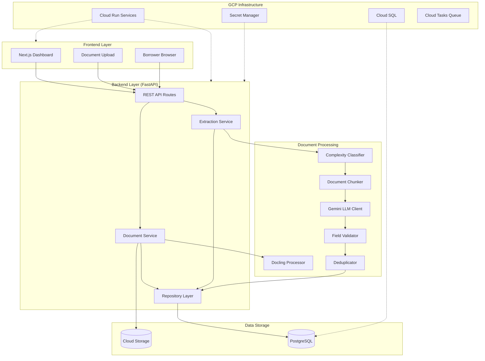
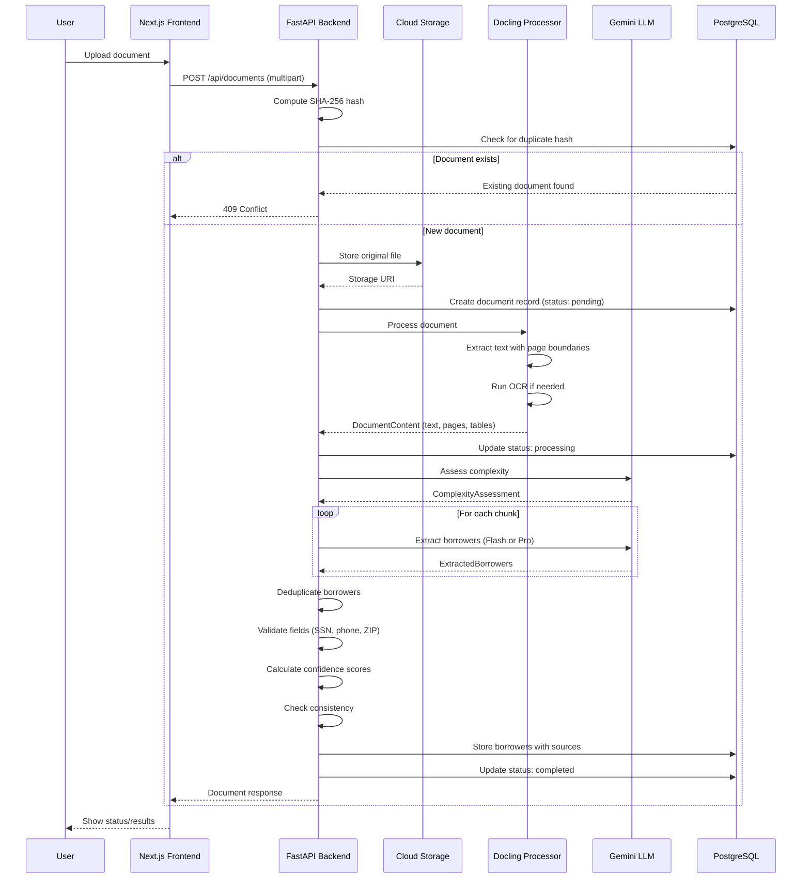
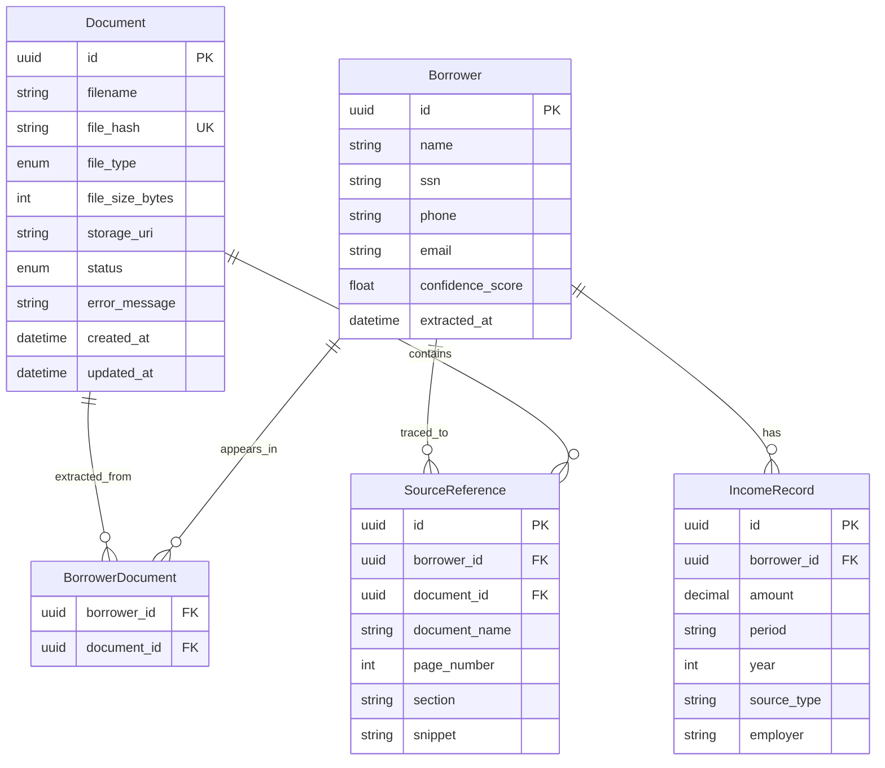
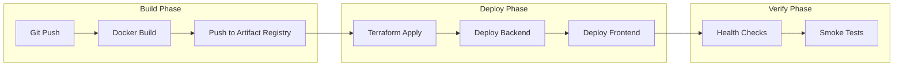

# Loan Document Extraction System - System Design

**Version:** 1.0
**Last Updated:** 2026-01-24
**Authors:** Development Team

---

## Architecture Overview

### Executive Summary

The Loan Document Extraction System is an AI-powered platform that transforms unstructured loan documents into structured borrower data. At its core, the system solves a real problem in financial services: loan documents arrive in various formats (PDFs, Word documents, scanned images) with borrower information scattered across multiple pages in inconsistent layouts. Manually extracting this data is tedious, error-prone, and doesn't scale.

Our solution combines Docling for production-grade document parsing with Google's Gemini 3.0 LLM for intelligent data extraction. The system processes documents through a multi-stage pipeline that preserves complete traceability - every extracted field (SSN, income figures, account numbers) links back to its source document and page number. This source attribution is essential for audit trails and manual review workflows.

The architecture follows cloud-native principles: serverless compute on Cloud Run for cost efficiency, managed PostgreSQL for reliable storage, and Infrastructure as Code via Terraform for reproducible deployments. The frontend provides a clean dashboard for document uploads, status tracking, and borrower data exploration.

### High-Level Architecture



### Technology Stack

| Component | Technology | Version | Purpose |
|-----------|------------|---------|---------|
| **Frontend Framework** | Next.js | 14+ | React server components, App Router for modern SSR |
| **UI Components** | shadcn/ui | Latest | Accessible, customizable component library |
| **Styling** | Tailwind CSS | 4.0 | Utility-first CSS framework |
| **Backend Framework** | FastAPI | 0.115+ | Async Python API with OpenAPI docs |
| **Document Processing** | Docling | 2.70+ | PDF, DOCX, image parsing with OCR |
| **LLM Provider** | Google Gemini | 3.0 | Flash and Pro models for extraction |
| **Database** | PostgreSQL | 16 | Relational storage with ACID guarantees |
| **ORM** | SQLAlchemy | 2.0+ | Async ORM with repository pattern |
| **Cloud Platform** | Google Cloud | - | Cloud Run, Cloud SQL, Cloud Storage |
| **Infrastructure** | Terraform | 1.6+ | Infrastructure as Code |
| **Container Runtime** | Docker | - | Multi-stage builds for backend/frontend |

---

## Component Interaction

### Document Upload and Extraction Flow

The following sequence diagram shows how a document flows through the system from upload to extracted borrower data:



---

## Data Flow

### Entity Relationship Model

The system uses a relational model that maintains complete traceability from extracted data back to source documents:



### Source Attribution Chain

Every piece of extracted data traces back to its origin. This is critical for audit trails and manual verification:

1. **Document Upload**: Original file stored in GCS with SHA-256 hash for deduplication
2. **Page Extraction**: Docling preserves page boundaries during text extraction
3. **Chunk Processing**: Each chunk knows its character position in the original document
4. **LLM Extraction**: Borrower data extracted with page number and text snippet
5. **Source Reference**: Created linking borrower field -> document -> page -> snippet

This chain allows a reviewer to click on any extracted field (like an SSN or income amount) and see exactly which page and section of which document it came from.

### Data Quality Pipeline

Data flows through multiple validation stages:

1. **Format Validation**: SSN (XXX-XX-XXXX), phone (US format via phonenumbers library), ZIP (5-digit or 5+4)
2. **Deduplication**: Matches borrowers across chunks using SSN > account numbers > fuzzy name matching
3. **Consistency Checks**: Flags income anomalies (>50% drop or >300% spike), address conflicts
4. **Confidence Scoring**: Combines field completeness, validation results, and source count into 0.0-1.0 score

Records with confidence below 0.7 are flagged for manual review.

---

## Document Extraction Pipeline

### Pipeline Overview

The extraction pipeline transforms raw documents into structured borrower records through a series of coordinated stages:

```mermaid
flowchart LR
    subgraph Ingestion["1. Ingestion"]
        Upload[File Upload]
        Hash[SHA-256 Hash]
        Store[GCS Storage]
        Parse[Docling Parse]
    end

    subgraph Analysis["2. Analysis"]
        Complexity[Complexity Assessment]
        Chunk[Document Chunking]
    end

    subgraph Extraction["3. Extraction"]
        LLM[LLM Extraction]
        Validate[Field Validation]
    end

    subgraph Consolidation["4. Consolidation"]
        Dedup[Deduplication]
        Consistency[Consistency Check]
        Score[Confidence Scoring]
    end

    subgraph Storage["5. Storage"]
        DB[(PostgreSQL)]
    end

    Upload --> Hash --> Store --> Parse
    Parse --> Complexity --> Chunk
    Chunk --> LLM --> Validate
    Validate --> Dedup --> Consistency --> Score
    Score --> DB
```



### Stage Details

#### Stage 1: Document Ingestion

**File Upload and Hashing**
- Accept PDF, DOCX, PNG, JPG files via multipart form upload
- Compute SHA-256 hash before any processing for duplicate detection
- Store original file in Google Cloud Storage with structured path: `documents/{year}/{month}/{document_id}/{filename}`

**Docling Processing**
- Create fresh DocumentConverter per document (prevents memory leaks per GitHub issue #2209)
- Extract text as Markdown preserving structure (headings, tables, lists)
- Maintain page-level text boundaries for source attribution
- Run OCR automatically on scanned/image-based documents
- Configuration: `enable_ocr=True`, `enable_tables=True`, `max_pages=100`

#### Stage 2: Complexity Assessment

**Classification Criteria**
- **STANDARD** (use Flash model): Single-borrower, clear scan, <10 pages
- **COMPLEX** (use Pro model): Triggers if any of:
  - Multiple borrower indicators (co-borrower, joint applicant, spouse mentions)
  - Large documents (>10 pages)
  - Poor scan quality (>3 illegible markers, garbled characters)
  - Handwritten content detected

**Chunking Strategy**
- Maximum chunk size: 16,000 characters (~4,000 tokens at 4 chars/token)
- Overlap between chunks: 800 characters (~200 tokens)
- Paragraph-aware splitting: Searches last 20% of chunk for `\n\n` to avoid splitting entities
- Each chunk tracks its start/end character positions in original document

#### Stage 3: LLM Extraction

**Gemini API Client**
- Models: `gemini-3-flash-preview` (default) or `gemini-3-pro-preview` (complex docs)
- Temperature: 1.0 (required for Gemini 3 optimal performance)
- Response format: `application/json` with Pydantic schema for structured output
- Retry logic: Exponential backoff with jitter (1s initial, 60s max, 3 attempts)
- No `max_output_tokens` set (causes None response with structured output)

**Extraction Schema**
Extracts per chunk:
- Borrower name, SSN, phone, email
- Address (street, city, state, ZIP)
- Income records (amount, period, year, source type, employer)
- Account and loan numbers

#### Stage 4: Validation

**Field Validation**
- SSN: Regex `^\d{3}-?\d{2}-?\d{4}$`, warns if dashes missing
- Phone: phonenumbers library for robust US validation
- ZIP: `^\d{5}(-\d{4})?$` for 5-digit or 5+4 format
- Year: Range check 1950 to current year + 1

**Deduplication**
Priority order for matching duplicates:
1. Exact SSN match
2. Overlapping account numbers
3. Fuzzy name (90%+) + same ZIP code
4. Very high name match (95%+) alone
5. Moderate name (80%+) + last 4 SSN digits match

Uses rapidfuzz library for efficient fuzzy matching.

**Consistency Checking**
Runs after deduplication to flag issues for human review:
- Income drops >50% year-over-year
- Income spikes >300% year-over-year
- Address conflicts across documents for same borrower

#### Stage 5: Confidence Scoring

Formula components:
- **Field Completeness** (40%): Weighted by field importance
- **Format Validation** (30%): Bonus for passing all format checks
- **Source Count** (20%): Bonus for data corroborated across multiple sources
- **No Penalties** (10%): Bonus for no validation warnings

Records with confidence < 0.7 are flagged for manual review.

---

## AI/LLM Integration

### Model Selection Strategy

The system uses dynamic model selection to balance cost and accuracy:

| Scenario | Model | Rationale |
|----------|-------|-----------|
| Single borrower, clear scan, <10 pages | Flash | Faster, cheaper, sufficient accuracy |
| Multiple borrowers detected | Pro | Better at tracking multiple entities |
| Poor scan quality | Pro | Superior reasoning through noise |
| Handwritten content | Pro | Better OCR interpretation |
| Large documents (>10 pages) | Pro | Better context handling |

### Prompt Engineering

**System Prompt**
The extraction prompt provides:
1. Role definition: "You are a document extraction specialist"
2. Task specification: Extract borrower data from loan documents
3. Output schema: Pydantic model defining exact structure expected
4. Field guidance: What each field should contain with examples

**Structured Output**
- Uses `response_json_schema` with Pydantic model schema
- Guarantees valid JSON matching expected structure
- No post-processing parsing needed
- Validation happens at Pydantic layer

### Cost Analysis

| Model | Input Cost | Output Cost | Avg Doc (5 pages) | Notes |
|-------|------------|-------------|-------------------|-------|
| Flash | $0.10/1M tokens | $0.40/1M tokens | ~$0.001 | Default for standard docs |
| Pro | $1.25/1M tokens | $5.00/1M tokens | ~$0.012 | 12x more expensive |

**Cost Optimization**:
- Complexity classifier routes 70-80% of documents to Flash
- Chunking prevents token limit issues without sacrificing context
- Structured output reduces output tokens vs free-form responses

### Token Usage Tracking

Every LLM call tracks:
- `input_tokens`: Prompt size
- `output_tokens`: Response size
- `latency_ms`: Request duration
- `model_used`: Which model was called
- `finish_reason`: Why generation stopped

This data feeds into cost monitoring and performance optimization.

---

## Error Handling

### Error Categories and Recovery

| Error Type | Detection | Recovery Strategy |
|------------|-----------|-------------------|
| **Rate Limit (429)** | Gemini API response | Exponential backoff with jitter, 3 retries |
| **Server Error (500)** | Gemini API response | Retry up to 3 times, fail document if exhausted |
| **Timeout** | Request exceeds limit | Retry with smaller chunk size |
| **Validation Failure** | Pydantic ValidationError | Log error, continue with valid records |
| **Parse Error** | JSON decode failure | Mark document failed, log raw response |
| **Document Corruption** | Docling exception | Mark document failed with error message |

### Status Tracking

Documents progress through states:

```
PENDING -> PROCESSING -> COMPLETED
                     -> FAILED (with error_message)
```

The frontend polls document status every 2 seconds while processing, stops polling when terminal state reached.

### Graceful Degradation

When errors occur during extraction:
1. Individual chunk failures don't fail entire document
2. Partial borrower data is saved if some chunks succeed
3. Validation errors are logged but valid data is preserved
4. Consistency warnings flag issues without blocking storage

---

## Scaling Analysis

### Current Architecture Characteristics

**Bottlenecks Identified:**
1. **Docling Processing**: CPU-intensive, ~2-5s per page depending on complexity
2. **LLM API Calls**: Network-bound, ~1-3s per chunk (Flash), ~3-8s (Pro)
3. **Database Writes**: Minimal overhead, async SQLAlchemy handles well

**Current Capacity (Single Instance):**
- ~100-200 documents/day with sequential processing
- Limited by Cloud Run cold start latency on first request

### 10x Scale Projections (1,000-2,000 docs/day)

| Resource | Current | 10x Projection | Mitigation |
|----------|---------|----------------|------------|
| **Cloud Run Instances** | 0-1 | 3-5 concurrent | Auto-scaling handles this |
| **LLM API Costs** | ~$1/day | ~$10-15/day | Complexity classifier optimization |
| **Database Connections** | 1-2 | 10-20 | Connection pooling (already configured) |
| **GCS Storage** | ~100 MB/day | ~1 GB/day | Lifecycle policies (NEARLINE at 90d) |
| **PostgreSQL Storage** | ~50 MB/day | ~500 MB/day | Cloud SQL auto-resize |

**Optimizations Already In Place:**
- `selectinload()` for eager loading prevents N+1 queries
- Repository pattern enables query optimization without API changes
- Async SQLAlchemy for non-blocking database operations

### 100x Scale Projections (10,000-20,000 docs/day)

| Resource | 100x Projection | Required Changes |
|----------|-----------------|------------------|
| **Cloud Run** | 10-15 concurrent | Increase max_instance_count |
| **Cloud Tasks** | 10/s rate, 5 concurrent | Queue handles backpressure |
| **Database** | 100-200 connections | Move to Cloud SQL HA, increase tier |
| **LLM Costs** | $100-150/day | Batch processing, caching common patterns |
| **GCS** | 10 GB/day | Already handled by lifecycle policies |

**Architecture Changes Needed at 100x:**
1. **Batch Processing**: Group documents for bulk LLM calls
2. **Result Caching**: Cache extraction results for similar documents
3. **Read Replicas**: Add Cloud SQL read replica for query load
4. **CDN**: Put frontend behind Cloud CDN for static assets
5. **Async Processing**: Move all extraction to Cloud Tasks (currently synchronous)

### Scaling Projections Table

| Scale | Docs/Day | Est. Monthly Cost | Architecture Tier |
|-------|----------|-------------------|-------------------|
| Current | 100-200 | $50-100 | Single instances, synchronous |
| 10x | 1,000-2,000 | $300-500 | Auto-scaling, connection pooling |
| 100x | 10,000-20,000 | $2,000-3,000 | Queue-based, read replicas, caching |
| 1000x | 100,000+ | $15,000+ | Distributed processing, custom models |

---

## Security Considerations

### Network Security

**VPC Configuration:**
- Private VPC with CIDR 10.0.0.0/16 for internal resources
- Cloud SQL has private IP only (no public endpoint)
- Cloud Run uses Direct VPC Egress for database access
- `PRIVATE_RANGES_ONLY` egress policy limits outbound traffic

**Access Control:**
- Cloud Run services publicly accessible (demo application)
- Database access only from Cloud Run service account
- No SSH or bastion hosts needed

### Secrets Management

All sensitive configuration stored in Google Secret Manager:
- `DATABASE_URL`: PostgreSQL connection string
- `GEMINI_API_KEY`: Google AI API key

Secrets injected into Cloud Run at runtime via `secret_key_ref`, never stored in Terraform state or environment files.

### Container Security

**Non-Root Execution:**
```dockerfile
# Backend
RUN useradd --create-home --shell /bin/bash appuser
USER appuser

# Frontend
USER node
```

**Minimal Base Images:**
- Backend: `python:3.12-slim` (smaller attack surface)
- Frontend: `node:20-alpine` (minimal Linux)

### Data Handling

**PII Considerations:**
- SSN stored in database (marked as sensitive in schema)
- No PII in logs (structured logging with field filtering)
- GCS files are original documents (contain PII)
- No encryption beyond GCP defaults (adequate for demo)

**Production Recommendations (not implemented):**
- Encrypt SSN at application level before storage
- Implement data retention policies with automatic purging
- Add audit logging for PII access
- Enable Cloud Audit Logs for compliance

---

## Deployment Architecture

### Infrastructure as Code

All GCP resources managed via Terraform:

```
infrastructure/terraform/
├── main.tf          # Provider config, API enablement
├── variables.tf     # Input variables
├── vpc.tf           # Private network, subnets
├── iam.tf           # Service accounts, roles
├── cloud_sql.tf     # PostgreSQL instance
├── secrets.tf       # Secret Manager secrets
├── cloud_storage.tf # Document storage bucket
├── cloud_tasks.tf   # Processing queue
├── cloud_run.tf     # Backend and frontend services
└── outputs.tf       # Deployed URLs
```

**State Management:**
- Remote state in GCS bucket
- State locking via GCS object locking
- Sensitive values marked to avoid logging

### Cloud Run Configuration

**Backend Service:**
- Image: `{region}-docker.pkg.dev/{project}/loan-repo/backend:{tag}`
- Memory: 1Gi (Docling processing needs memory)
- CPU: 1
- Scaling: 0-10 instances
- Startup probe: `/health` endpoint with 10s initial delay

**Frontend Service:**
- Image: `{region}-docker.pkg.dev/{project}/loan-repo/frontend:{tag}`
- Memory: 512Mi
- CPU: 1
- Scaling: 0-5 instances
- Environment: `NEXT_PUBLIC_API_URL` points to backend

### Deployment Workflow



**Deployment Commands:**
```bash
# Build and push images
./infrastructure/scripts/build.sh

# Deploy infrastructure
cd infrastructure/terraform
terraform init -backend-config="bucket=${TF_STATE_BUCKET}"
terraform apply -var="project_id=${PROJECT_ID}" -var="image_tag=${GIT_SHA}"
```

---

## Appendix: Configuration Reference

### Environment Variables

| Variable | Description | Required |
|----------|-------------|----------|
| `DATABASE_URL` | PostgreSQL connection string | Yes |
| `GEMINI_API_KEY` | Google AI API key | Yes |
| `GCS_BUCKET` | Cloud Storage bucket name | Yes (production) |
| `CLOUD_TASKS_QUEUE` | Queue ID for async processing | No (sync mode if missing) |
| `NEXT_PUBLIC_API_URL` | Backend URL for frontend | Yes (frontend only) |

### Terraform Variables

| Variable | Description | Default |
|----------|-------------|---------|
| `project_id` | GCP project ID | (required) |
| `region` | GCP region | us-central1 |
| `environment` | Environment name | dev |
| `image_tag` | Docker image tag | latest |

### Key Files Reference

| Path | Purpose |
|------|---------|
| `backend/src/main.py` | FastAPI application entry point |
| `backend/src/extraction/extractor.py` | Main extraction orchestrator |
| `backend/src/extraction/llm_client.py` | Gemini API client |
| `backend/src/ingestion/docling_processor.py` | Document parsing |
| `frontend/src/app/` | Next.js App Router pages |
| `infrastructure/terraform/` | Terraform configuration |
